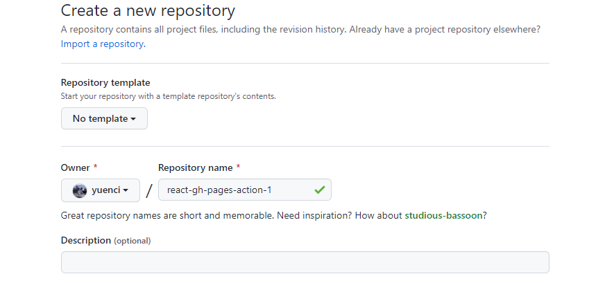
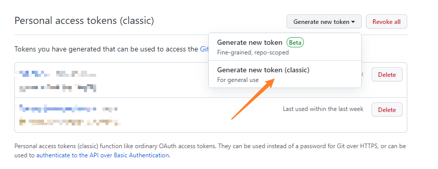
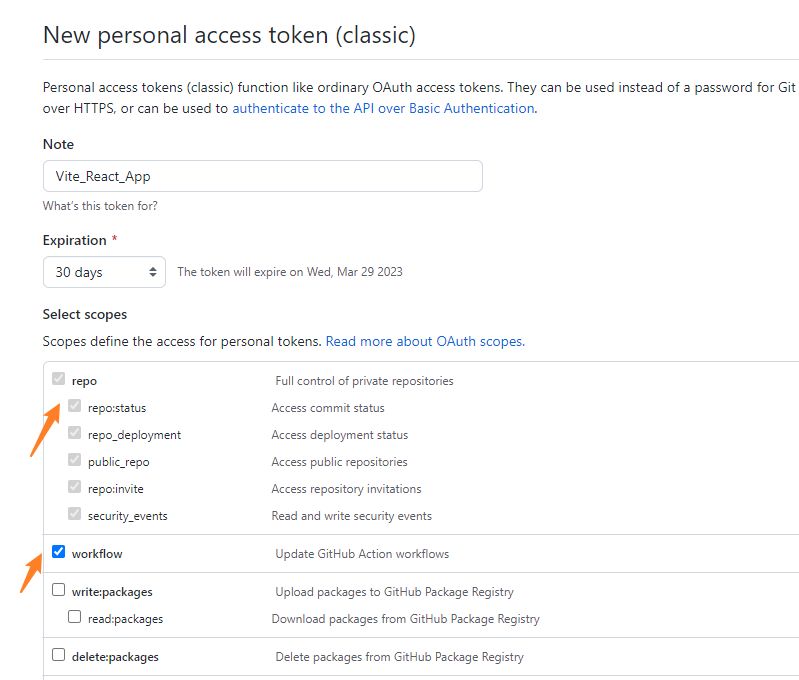
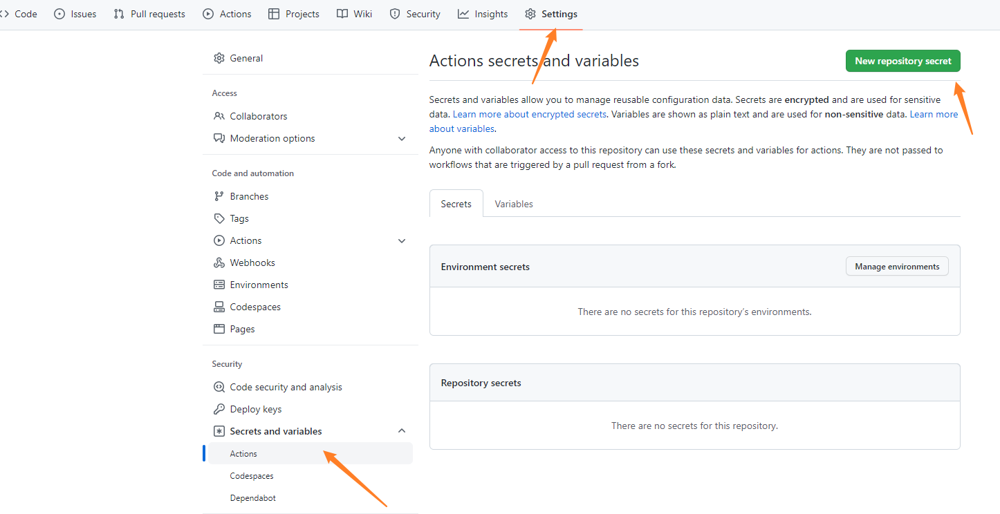
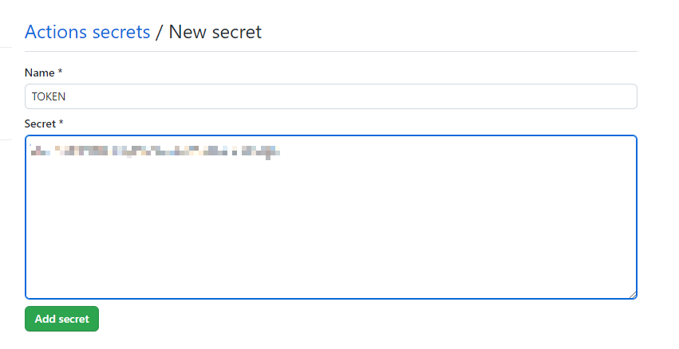
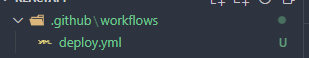
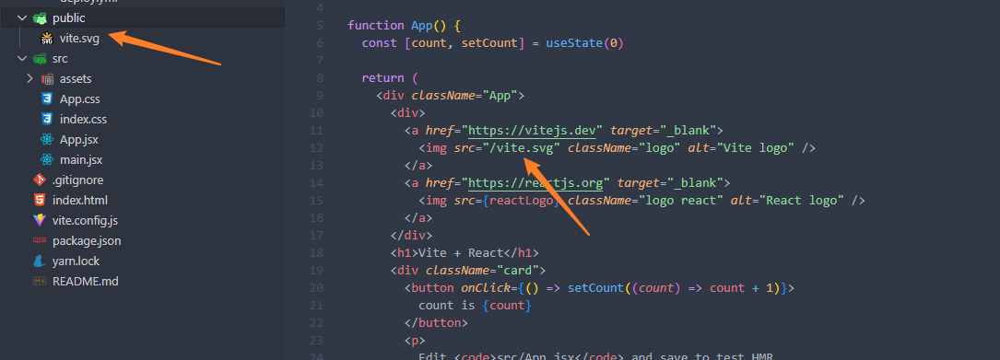
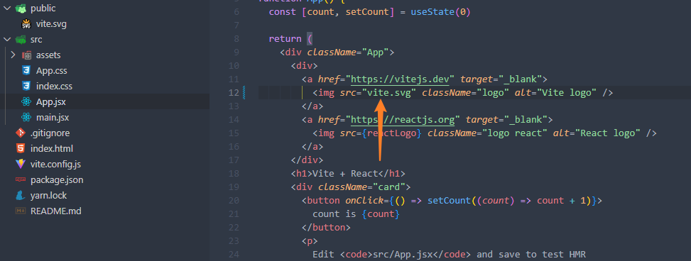

### 1. Creat React APP

```bash
yarn create vite
```

### 2. Modify vite.config.js
```js
export default defineConfig({
  plugins: [react()],
  build: {
    outDir: 'build'
  },
  base: './',
})
```

### 3. Initialize git

```bash
git init
```


### 4. Create github repo




### 5. Rename local branch and set remote branch

```bash
git remote add origin https://github.com/yuenci/react-gh-pages-action1.git
git branch -M main
git push -u origin main
```

### 6. Create gh-pages branch

Commit your project before your execute blow commands

```bash
git checkout -b gh-pages
# create a new branch
```

### 7. Generate token

Go to: https://github.com/settings/tokens





### 8. Set token



### 9. Create .github/workflows folder, then create a deploy.yml in it.



```yml
# deploy.yml
name: Build and Deploy
on:
  push:
    branches:
      - main # Set a branch to deploy

jobs:
  build-and-deploy:
    runs-on: ubuntu-latest
    steps:
      - name: Checkout 🛎️
        uses: actions/checkout@v3

      - name: Install and Build 🔧 # This example project is built using npm and outputs the result to the 'build' folder. Replace with the commands required to build your project, or remove this step entirely if your site is pre-built.
        run: |
          npm install yarn -g
          yarn
          yarn build

      - name: Deploy 🚀
        uses: JamesIves/github-pages-deploy-action@v4
        with:
          folder: build # The folder the action should deploy.
          BRANCH: gh-pages # The branch the action should deploy to.
          Token: ${{ secrets.TOKEN }} # This token is provided by Actions, you do not need to create your own token.
```

### 10. Switch to main branch, then commit new code, CI/CD will proceed automatically.


### PS:

1. The resources in the public file directly use the relative path, and there is no need to write "public", otherwise the compilation will be wrong.

Wrong way:


Correct Way:


2. Don't need to configure pages, the action will automatically complete the relevant configurations.